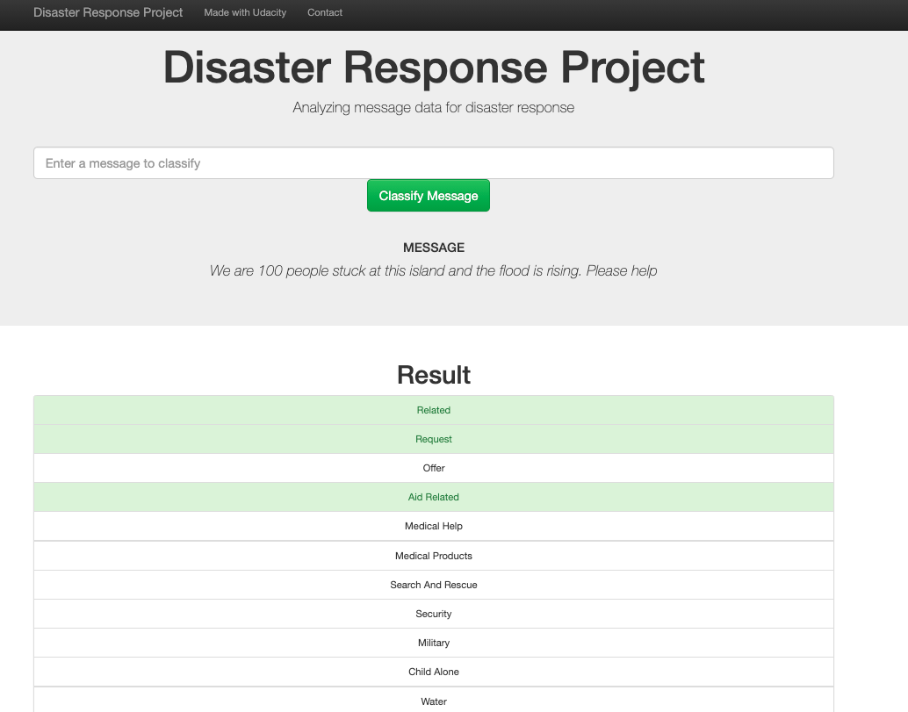
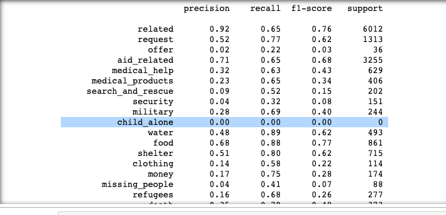
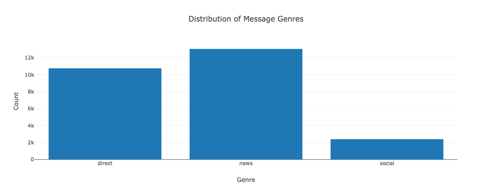

# Disaster Response Pipeline Project
## Summary
- Libraries
- Project Motivation 
- Project Description
- Repository 
- Results
- Instruction to run
- Credits


## Libraries
All libraries are available in Anaconda distribution of Python.

[sys](https://www.python-course.eu/sys_module.php) - For information about constants, functions and methods; 

[pandas](https://pandas.pydata.org/pandas-docs/stable/getting_started/install.html) - For data manipulation and analysis;

[sqlalchemy](https://numpy.org/doc/stable/user/absolute_beginners.html) - An open-source SQL toolkit and object-relational mapper for the Python programming language;

[re](https://docs.python.org/3/library/re.html) - For processing regular expressions;

[nltk](https://www.nltk.org/) - Natural Language Toolkit, is a suite of libraries and programs for symbolic and statistical natural language processing for English written in the Python programming language;

[pickle](https://docs.python.org/3/library/pickle.html) - For serializing and deserializing a Python object structure;

[sklearn](https://scikit-learn.org/stable/) - Machine learning library; 

[numpy](https://numpy.org/doc/stable/user/absolute_beginners.html) - For mathematical functions;

[Flask](https://flask.palletsprojects.com/en/1.1.x/) - is a micro web framework written in Python;

[plotly](https://plotly.com/) - For plotting charts;

## Project Motivation 

The goal of the project is to analyze disaster data from [Figure Eight](https://www.figure-eight.com/) to build a model for an API that classifies disaster messages 

## Project Description

The project uses a data set containing real messages that were sent during disaster events  to create a machine learning pipeline to categorize these events so that you can send the messages to an appropriate disaster relief agency.

The project includes a web app where an emergency worker can input a new message and get classification results in several categories. The web app will also display visualizations of the data used to train the classifier.


## Results
 
The application in action!


The project is deployed [here](http://disasterapp.andysee.com/) - but at the moment, there is an issue I'm working to resolve. on loading the model, the application breaks because it can't find the tokenize function. The error message says: AttributeError: module '__main__' has no attribute 'tokenize'; 

## Observations
I observed that although the classifier works, its not producing the optimum results. 
This is because the dome of the classes like "child-alone" and "offer" have very few values that in the classification report, they sometimes show up with 0 as shown in the image below.

This affects the training model as there is little (and sometimes no) data to train with. 
From the above image, we also notice that certain fields like "related" and "weather_related" have a high precision (proportion of positive identifications) meaning that our model is more likely going to accurately classify those categories.

The recall is generally high meaning that -- of the actual positive values, a good percentage of them is getting classified correctly. This is a better result.

precision and recall of the 
## Visualization



## Instructions to run 
1. Run the following commands in the project's root directory to set up your database and model.

    - To run ETL pipeline that cleans data and stores in database
        `python data/process_data.py data/disaster_messages.csv data/disaster_categories.csv data/messages.db`
    - To run ML pipeline that trains classifier and saves
        `python models/train_classifier.py data/messages.db models/classifier.pkl`

2. Run the following command in the app's directory to run your web app.
    `python run.py`

3. Go to http://0.0.0.0:3001/

## Repository Description
Below is the directory structure of the app. I deleted the classifier because it was too big for github.
```
.
├── app
│   ├── run.py------------------------# FLASK FILE THAT RUNS APP
│   │   
│   └── templates
│       ├── go.html-------------------# CLASSIFICATION RESULT PAGE OF WEB APP
│       └── master.html---------------# MAIN PAGE OF WEB APP
├── data
│   ├── DisasterResponse.db-----------# DATABASE TO SAVE CLEANED DATA TO
│   ├── disaster_categories.csv-------# DATA TO PROCESS
│   ├── disaster_messages.csv---------# DATA TO PROCESS
│   └── process_data.py---------------# PERFORMS ETL PROCESS
├── ETL Pipeline Preparation.ipynb----# The Jupyter notebook used to draft the ETL pipeline
├── images-------------------------------# PLOTS FOR USE IN README AND THE WEB APP
├── ML Pipeline Preparation.ipynb----# The Jupyter notebook used to draft the Macine learning pipeline
├── models
│   └── train_classifier.py-----------# PERFORMS CLASSIFICATION TASK

```
